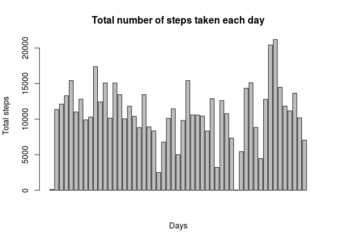
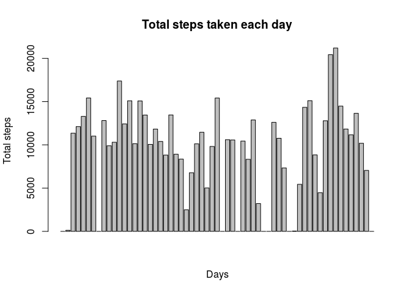
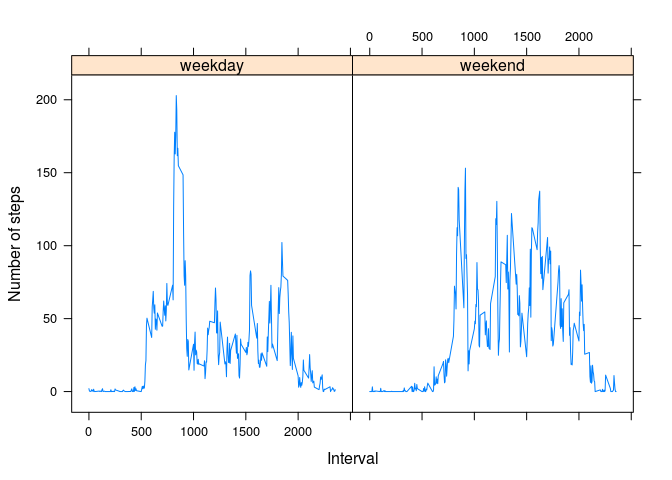

# Reproducible Research: Peer Assessment 1


## Loading and preprocessing the data


```r
library(data.table)
library(lattice)
actO<-fread("activity.csv",colClasses=c("integer","POSIXct","integer"))
actO$date<-as.Date(actO$date,"%Y-%m-%d")
```
Original data looks like  


```r
str(actO)
```

```
## Classes 'data.table' and 'data.frame':	17568 obs. of  3 variables:
##  $ steps   : int  NA NA NA NA NA NA NA NA NA NA ...
##  $ date    : Date, format: "2012-10-01" "2012-10-01" ...
##  $ interval: int  0 5 10 15 20 25 30 35 40 45 ...
##  - attr(*, ".internal.selfref")=<externalptr>
```

```r
head(actO)
```

```
##    steps       date interval
## 1:    NA 2012-10-01        0
## 2:    NA 2012-10-01        5
## 3:    NA 2012-10-01       10
## 4:    NA 2012-10-01       15
## 5:    NA 2012-10-01       20
## 6:    NA 2012-10-01       25
```

## What is mean total number of steps taken per day?

```r
total_steps_each_day<-aggregate(steps~date,actO,sum,na.rm=T)
barplot(total_steps_each_day$steps,main="Total number of steps taken each day",xlab="Days",ylab="Total steps")
```

 

Mean of total steps is 1.0766189\times 10^{4}  
Median of total steps is 10765


## What is the average daily activity pattern?


```r
mean_steps_per_interval<-aggregate(steps~interval,actO,mean)
plot(mean_steps_per_interval$interval,mean_steps_per_interval$steps,type="l",main="Average number of steps taken",xlab="Interval",ylab="Mean steps")
max_steps_interval<-subset(mean_steps_per_interval,steps==max(steps))
abline(v=max_steps_interval$interval,col="red")
```

 

Interval 835, 206.1698113 contains the maximum number of steps. It is also displayed on the above graph


## Imputing missing values

The total number of missing values in the original dataset is 2304


```r
na_indices<-which(is.na(actO$steps))
mean_steps_each_day<-aggregate(steps~date,actO,mean,na.rm=T,na.action=na.pass)
actM<-actO
nnn<-sapply(na_indices,function(x){
  na_date<-actM[x,date]
  mean_step_for_date<-mean_steps_each_day$steps[mean_steps_each_day$date==na_date]
  if(is.nan(mean_step_for_date)) {
    mean_steps_each_day$steps[mean_steps_each_day$date==na_date]<<-0
  }
  actM[x,"steps"]<<-0
})
```

A new dataset that is equal to the original dataset but the missing values filled in by the mean value on that day is:  


```r
str(actM)
```

```
## Classes 'data.table' and 'data.frame':	17568 obs. of  3 variables:
##  $ steps   : int  0 0 0 0 0 0 0 0 0 0 ...
##  $ date    : Date, format: "2012-10-01" "2012-10-01" ...
##  $ interval: int  0 5 10 15 20 25 30 35 40 45 ...
##  - attr(*, ".internal.selfref")=<externalptr>
```

```r
total_steps_each_day2<-aggregate(steps~date,actM,sum)
barplot(total_steps_each_day2$steps,main="Total steps taken each day",xlab="Days",ylab="Total steps")
```

 

Mean of total steps per day is 9354.2295082  
Median of total steps per day is 10395  


## Are there differences in activity patterns between weekdays and weekends?


```r
actM$weektype<-apply(actM,1,function(x){
  wd<-weekdays(as.Date(x[[2]]))
  if(wd=="Sunday" | wd=="Saturday") {
    "weekend"
  }else {
    "weekday"
  }
  
})
actM$weektype<-factor(actM$weektype)

mean_steps_per_interval_per_weektype<-aggregate(steps~interval+weektype,actM,mean)
xyplot(steps~interval|weektype,data=mean_steps_per_interval_per_weektype,type="l",ylab="Number of steps",xlab="Interval")
```

 
